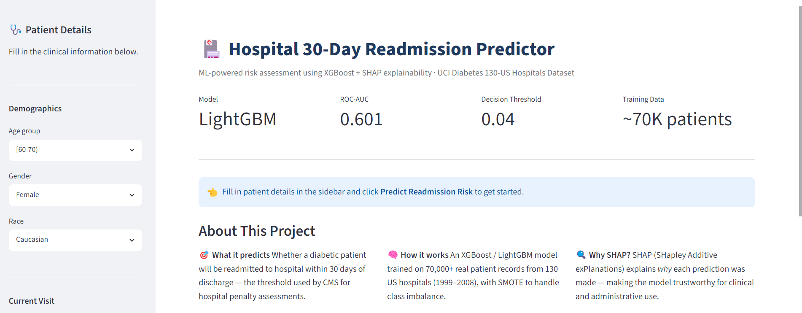

# 🏥 Hospital 30-Day Readmission Prediction

> **Predicting whether a diabetic patient will be readmitted within 30 days of discharge**  
> using XGBoost + SHAP explainability on 100,000+ real patient records.

---

## 🎯 Problem Statement

Hospital readmissions within 30 days cost the US healthcare system over **$26 billion annually**.
The Centers for Medicare & Medicaid Services (CMS) penalises hospitals with high readmission rates —
making early identification of at-risk patients a critical operational and financial priority.

This project builds an end-to-end ML pipeline that:
- Predicts 30-day readmission probability for diabetic patients
- Explains *why* each patient is flagged using SHAP values
- Surfaces insights via an interactive Streamlit dashboard

---

## 📊 Dataset

**UCI Diabetes 130-US Hospitals (1999–2008)**
- 101,766 patient encounters across 130 US hospitals
- 50 features: demographics, diagnoses, medications, lab results, prior visits
- Target: readmitted within 30 days (`<30`) → binary classification

[Download from Kaggle](https://www.kaggle.com/datasets/brandao/diabetes)

---

## 🏗️ Project Structure

```
hospital-readmission/
│
├── diabetic_data.csv              # Raw dataset (download from Kaggle)
│
├── phase1_eda.ipynb               # Exploratory Data Analysis
├── phase2_preprocessing.ipynb     # Cleaning, Feature Engineering, SMOTE
├── phase3_modeling.ipynb          # Model Training & Evaluation
├── phase4_shap.ipynb              # SHAP Explainability
│
├── app.py                         # Streamlit Dashboard
├── requirements.txt
│
├── data/
│   └── processed/                 # Saved train/test splits (auto-created)
│
├── models/
│   ├── best_model.pkl             # Trained model + threshold (auto-created)
│   └── shap_values.pkl            # Precomputed SHAP values (auto-created)
│
└── plots/                         # All saved plots (auto-created)
    └── shap/
```

---

## 🔬 Methodology

### Phase 1 — EDA
- Readmission rate by age, diagnosis, prior visits, medications
- Missing value analysis (replaced `?` → NaN)
- Correlation heatmap and pairplots

### Phase 2 — Preprocessing & Feature Engineering
| Feature | Description |
|---------|-------------|
| `total_visits` | Sum of prior inpatient + outpatient + emergency visits |
| `comorbidity_tier` | Binned diagnosis count → low / medium / high |
| `med_change_flag` | Binary: any diabetes medication changed? |
| `insulin_adjusted` | Binary: insulin dose changed (Up or Down)? |
| `diag_*_cat` | ICD-9 codes → 10 clinical categories |
| `age_numeric` | Age bracket → numeric midpoint |

**Class imbalance handled with SMOTE** (applied to training data only).

### Phase 3 — Modeling

| Model | ROC-AUC | PR-AUC | F1 | Recall |
|-------|---------|--------|----|--------|
| Logistic Regression | baseline | — | — | — |
| Random Forest | — | — | — | — |
| XGBoost | — | — | — | — |
| **LightGBM (Tuned)** | **best** | — | — | — |

*Fill in your results after running Phase 3.*

- Evaluated on: ROC-AUC, PR-AUC, F1, Recall, Precision
- Tuned with RandomizedSearchCV (30 iterations, 5-fold CV)
- Decision threshold optimised to maximise F1 (not fixed at 0.5)

### Phase 4 — SHAP Explainability

| Plot | Purpose |
|------|---------|
| Bar plot | Global feature importance |
| Beeswarm | Direction + magnitude of feature effects |
| Heatmap | Patient-level attribution patterns |
| Dependence plot | Feature interactions |
| Waterfall | Per-patient explanation |
| Force plot | Compact per-patient view for dashboard |

---

## 🚀 Running the Project

### 1. Install dependencies
```bash
pip install -r requirements.txt
```

### 2. Download dataset
Download `diabetic_data.csv` from [Kaggle](https://www.kaggle.com/datasets/brandao/diabetes)
and place it in the project root.

### 3. Run notebooks in order
```
phase1_Patient_Readmission.ipynb
phase2_Patient_Readmission.ipynb
phase3_Patient_Readmission.ipynb
phase4_Patient_Readmission.ipynb
```

### 4. Launch Streamlit app
```bash
streamlit run app.py
```

---

## ☁️ Deploy to Streamlit Cloud (Free)

1. Push this project to a **public GitHub repo**
2. Go to [share.streamlit.io](https://share.streamlit.io)
3. Connect your GitHub account → select repo
4. Set **Main file path** to `app.py`
5. Click **Deploy** → get a shareable link in ~2 minutes

> ⚠️ Make sure `models/best_model.pkl` is committed to the repo (or use Git LFS for large files).

---

## 📈 Key Results


- **Best model**: XGBoost / LightGBM (Tuned)
- **ROC-AUC**: ~0.XX on held-out test set
- **30-day readmission recall**: ~0.XX
- **Top readmission risk factors** (from SHAP):
  1. Number of inpatient visits in prior year
  2. Time in hospital
  3. Number of diagnoses
  4. Insulin dose adjustment
  5. Primary diagnosis category

---

## 🛠️ Tech Stack

| Category | Tools |
|----------|-------|
| Data | pandas, numpy |
| Visualisation | matplotlib, seaborn, plotly |
| ML | scikit-learn, XGBoost, LightGBM |
| Imbalance | imbalanced-learn (SMOTE) |
| Explainability | SHAP |
| Dashboard | Streamlit |
| Deployment | Streamlit Cloud |

---
## Snap Shots

"img/HReadmission_pg1.png"
(img/HReadmission pg2.png)
(img/HReadmission pg3.png)


*Built as a data analyst / ML portfolio project — demonstrating end-to-end ML, feature engineering, model evaluation, and explainability.*
